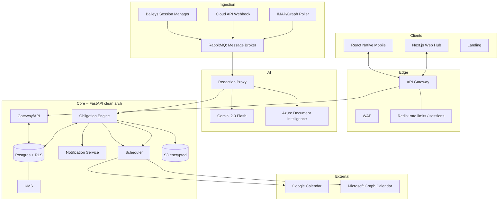
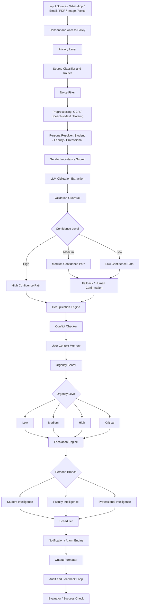

# Chatnalyxer v1 — Architecture

## Purpose & Scope
Privacy-preserving obligation engine for WhatsApp + Email. v1 uses **cloud-side ingestion with immediate redaction** (transparent “Option B”) while keeping full device sovereignty for long-term storage and triage.

## Goals
- Channels: WhatsApp (Baileys dev sandbox only, Cloud API prod), Email (IMAP/Graph).
- Privacy stance: v1 “privacy-preserving cloud processing” — inbound webhooks/pollers hit backend, redaction happens immediately; no raw persistence beyond in-memory queue; device remains system of record. Roadmap: Option A true local ingest.
- AI: Gemini 2.0 Flash (structured JSON), Azure Document Intelligence OCR; RAG-ready embeddings of sanitized text.
- Outputs: calendar events (Google/Microsoft), notifications/alarms, audit trail.
- Agent stance: context-aware obligation agent with confidence-based routing, persona-aware reasoning, escalation, and feedback-driven adaptation.

## High-Level Topology


## Agent Decision Flow


## Component Responsibilities
- **Mobile (RN)**: Local encrypted vault (SQLCipher/WatermelonDB), offline triage, push/pull sync, QR/pairing UI.
- **Web Hub (Next.js)**: Connect center, privacy console, audit timeline, admin (DLQ replay).
- **Ingestion**: Baileys multi-session for dev; Cloud API webhook for prod; IMAP/Graph poller for email; normalize to CloudEvents and push to RabbitMQ.
- **Redaction Proxy**: Presidio + regex + LLM-Guard; **per-request salted tokenization** (nonce sealed with tenant KMS); no deterministic reuse; ephemeral map in memory only.
- **AI Service**: Gemini with structured outputs + confidence thresholds; fallback rules engine; low-confidence → user confirmation. Azure DI for PDFs/images via async queue; emits obligations and evidence spans.
- **Obligation/State Engine**: State machine (Detected → Proposed → Confirmed → Scheduled → Rescheduled → Canceled); versioned analyses; **hybrid dedupe** (time-window + participant hash + semantic embedding); conflict-safe/idempotent.
- **Scheduler**: Google/Microsoft adapters; conflict rules (buffers, working hours, no double-book); time-zone safe; reschedule/cancel hooks; alarm/notification matrix.
- **Notification**: SES email, WA acks (templates), push (Expo/Firebase), in-app toasts.
- **Data Stores**: Postgres with RLS per user + tenant_id indices + “tenant required” guard; Redis for limits/locks; S3 for consented blobs (off by default); local vault on device (hot/cold tiers).
- **Observability**: OTel traces/metrics/logs → CloudWatch/X-Ray; dashboards for ingest latency, AI latency, calendar success, DLQ depth.

## Data Model (server)
| Table | Key Columns | Notes |
| --- | --- | --- |
| users | id (uuid), email, kms_key_id, settings | root; RLS by id |
| channels | id, user_id, provider (wa/email), auth_token_enc | per-tenant tokens |
| conversations | id, channel_id, external_thread_id, participant_hash | |
| messages | id, conversation_id, external_msg_id, content_enc, ts | redacted or empty; envelope only |
| obligations | id, conversation_id, title, start_time, end_time, state, confidence, source_fingerprint, analysis_version | lifecycle entity |
| schedules | id, obligation_id, external_event_id, provider, tz | calendar linkage |
| attachments | id, message_id, s3_url_enc, mime, size | only if consented |
| audits | id, user_id, action, actor, reason, ts | all state transitions |
| embeddings | id, user_id, payload_hash, vector | sanitized embeddings; usage toggle, always stored |

RLS policy: `USING (user_id = current_setting('app.current_tenant')::uuid)` on every user-scoped table **plus** tenant_id indexes and “reject if setting missing.” Optional per-tenant schemas for high-sensitivity cohorts.

## Event Contracts (CloudEvents v1.0)
- `chat.message.received`: `{message_id, thread_id, channel, sender_hash, ts, raw_text?, attachments[]}`
- `chat.message.updated`: `{message_id, thread_id, prev_text?, new_text, ts}`
- `chat.message.deleted`: `{message_id, thread_id, ts}`
- `channel.group.sync`: `{user_id, groups:[{whatsapp_id|folder_id, name, is_active}]}`
- `ai.analysis.requested`: `{payload_id, anonymized_text, context[], schema_version}`
- `obligation.created|updated`: `{obligation_id, delta, state, reason}`
- `calendar.schedule.changed`: `{obligation_id, provider, external_event_id, new_start, status}`

## API Surface (FastAPI)
- WhatsApp: `/whatsapp connect|status|qr|pairing|disconnect|sync-groups`
- Email: `/email connect|status|folders|sync`
- Groups: `/groups list|selection`
- Obligations: `/obligations`, `/obligations/{id}`
- Notifications: `/notifications/preferences`
- Audit: `/audit`
- Auth handled upstream (Cognito/Clerk) → JWT → app.current_tenant set in DB pool.

## Security & Privacy
- **Option B stated**: cloud ingestion with immediate redaction; no raw persistence; deletion SLA <5s for ingress buffers.
- Default redacted-only; full text/attachments only with explicit per-channel consent; consent revocation stops processing mid-pipeline.
- Per-tenant KMS keys; column encryption for tokens; per-request salted tokenization; S3 SSE-KMS (off by default); device keystore for vault key; remote wipe supported.
- DB guardrails: tenant_id in indexes; reject if `app.current_tenant` not set; optional per-tenant schema; JWT tenant checked in middleware and DB session.
- WAF + Redis rate limits; DLP size/type gates; secret scanning + SAST/DAST in CI; backup/restore encrypted and tested.

## Performance Targets
- Ingest → analysis: P50 < 10s, P95 < 15s (redacted path). Relaxed latency allows for higher-accuracy AI reasoning.
- Calendar write success > 99%; retries with backoff.
- Attachment OCR limit: 15 MB; overflow rejected with user notice.
- Offline tolerance: 72h queued ops without loss.

## Observability & Reliability
- OTel everywhere; dashboards: ingest latency, AI latency, calendar success, DLQ depth, OCR queue age.
- SQS DLQ + replay tool; session watchdog (Baileys dev); email poller heartbeat; ordering per user via message grouping key.
- Chaos drills: kill WA session, drop IMAP, network partition; verify recovery and idempotent replays.

## Data/Sync/AI Guardrails
- Dedupe: time-window + participant hash + semantic embedding cosine + text hash; user “merge?” prompt on high similarity.
- Conflicts: version vectors + field-level merge; conflict UI prompt; no silent overwrite.
- Offline queue: priority tiers, TTL per job, revalidate obligations on reconnect before apply.
- OCR: pre-filter MIME/size/pages; async queue; user “processing…” status; cap concurrency.
- AI reliability: confidence thresholds; fallback rules engine; low-confidence → user confirmation.
- RAG: embeddings always stored (sanitized); usage toggle at inference time to avoid codepath divergence.

## Rollout
- Alpha: Baileys-only **in isolated dev sandbox** with seeded numbers; internal testers; mock calendars allowed.
- Beta: Email + calendar writes, redacted-by-default, cohort waitlist; Cloud API shadow tests.
- Prod: Cloud API primary; Baileys dev-only/sandbox; WAF/rate limits tightened; adapters/monetization only behind flags.
```
