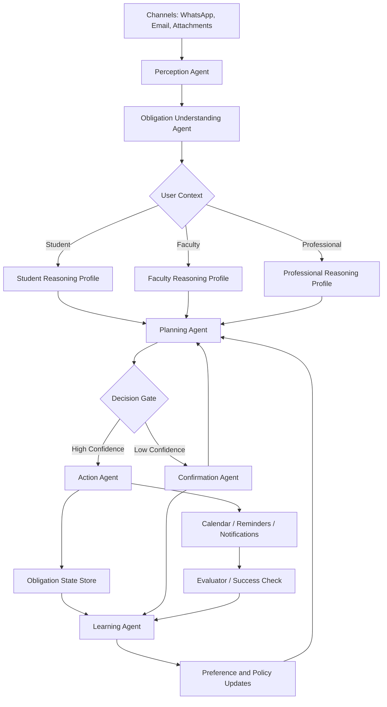

# Chatnalyxer Agent Builder Plan

## Why the current "agent" feels weak
The current architecture is strong on ingestion, extraction, redaction, and scheduling, but the "agent" is still implicit. It reads like:

`message in -> AI extracts obligation -> scheduler writes event`

That is useful, but it does not feel like a real agent because it does not clearly show:
- what the agent observes
- what the agent understands about the user
- how it decides what matters
- how it plans actions
- when it asks for confirmation
- how it learns from feedback

For presentations, this makes the idea feel correct but the agent-building story feel incomplete.

## Correct framing
Chatnalyxer should be presented as a:

**Context-aware obligation agent for students first, extensible to everyone else**

Not a calendar bot.
Not a task extractor.
Not a message summarizer.

The agent's job is:
1. Detect obligations from noisy communication.
2. Understand user context and urgency.
3. Build an execution plan.
4. Take safe actions.
5. Adapt from corrections and outcomes.

## Agent Definition
The Chatnalyxer agent has five layers:

1. **Perception Layer**
   Reads WhatsApp, email, attachments, OCR, and metadata.

2. **Understanding Layer**
   Identifies obligation type, deadline, confidence, source evidence, and user context.

3. **Planning Layer**
   Decides priority, timing, reminders, and whether the case should be auto-handled or sent for review.

4. **Action Layer**
   Creates reminders, drafts schedules, updates state, and triggers notifications.

5. **Learning Layer**
   Uses user edits, confirmations, dismissals, and completion outcomes to improve future planning.

## Final Agent Architecture

## What makes this actually agentic
- **Perception Agent** filters noise before extraction.
- **Understanding Agent** does more than extraction; it explains why something is an obligation.
- **Planning Agent** chooses among actions instead of blindly forwarding output.
- **Decision Gate** makes autonomy visible and safe.
- **Confirmation Agent** prevents bad auto-actions.
- **Learning Agent** closes the loop, which makes the system adaptive rather than static.

## Student-first reasoning
This is where your idea becomes differentiated.

For students, the agent should reason over:
- academic deadlines
- exam proximity
- assignment complexity
- class or lab timing
- urgency versus importance
- last-minute rescue mode

Faculty and professional branches should also exist in the architecture, even if their v1 depth is lighter:
- faculty: teaching schedules, reviews, approvals, academic admin
- professional: meetings, deliverables, stakeholder and deadline coordination

This does **not** mean everything becomes a visible planner feature in the current MVP UI. It means the agent architecture is designed to support persona-specific reasoning from the start.

## Clean explanation for judges
Use this wording:

> "Our system is not just extracting tasks from messages. It acts as an obligation agent. It observes communication, interprets obligations in context, decides how urgent they are, builds a safe action plan, and improves from user feedback. For students, that reasoning layer becomes specialized around deadlines, coursework, and time-sensitive academic pressure."

## MVP agent build plan

### Phase 1: Perception Agent
Build the agent's input normalization layer.
- unify WhatsApp and email into one event shape
- add attachment and OCR evidence support
- assign message confidence and source fingerprints
- classify noise vs candidate obligation

**Exit condition:** one normalized obligation candidate format across all channels.

### Phase 2: Understanding Agent
Build the obligation interpreter.
- extract title, date, deadline, participants, source spans
- classify obligation type: academic, event, admin, reminder, general
- attach confidence and evidence
- store explanation fields for auditability

**Exit condition:** every candidate has structured meaning, confidence, and evidence.

### Phase 3: Context Layer
Build user-aware reasoning profiles.
- start with `student`, `faculty`, and `professional`
- support preference weighting and quiet hours
- add academic-specific signals without hardcoding UI assumptions

**Exit condition:** same obligation can be scored differently across personas.

### Phase 4: Planning Agent
Build the real decision-making layer.
- priority scoring
- urgency windows
- reminder strategy
- schedule proposal strategy
- fallback to manual review on low confidence

**Exit condition:** the system produces a plan, not just extracted data.

### Phase 5: Action Agent
Build safe execution.
- create reminder
- propose calendar event
- notify user
- defer
- ask for confirmation

**Exit condition:** every plan resolves into an explicit action path.

### Phase 6: Learning Agent
Build adaptation loop.
- capture edits
- capture accepted/rejected plans
- capture snooze/dismiss/complete patterns
- update user preferences and scoring weights

**Exit condition:** user behavior changes future planning.

### Phase 7: Evaluator
Build post-action success checking.
- verify whether reminders were useful
- detect ignored versus completed obligations
- track corrections after action
- feed outcomes back into future planning

**Exit condition:** the system can measure whether its actions were actually helpful.

## Recommended v1 scope
To keep the build realistic, v1 should include:
- Perception Agent
- Understanding Agent
- Persona context split
- Planning Agent with confidence gates
- Action Agent for reminders and schedule proposals
- Learning Agent limited to preference tuning and correction feedback
- Evaluator with basic outcome tracking

Do **not** overbuild:
- multi-agent orchestration
- autonomous long-running workflows
- agent-to-agent delegation
- advanced memory systems
- broad persona explosion beyond student/faculty/professional

## Best one-line positioning
**Chatnalyxer is a privacy-focused obligation agent that turns noisy communication into context-aware plans and safe actions.**

## Best short roadmap pitch
**v1 proves the agent loop.**
We first make the system observe, understand, plan, and act safely.
After that, we deepen specialization for students and improve adaptation from feedback.
