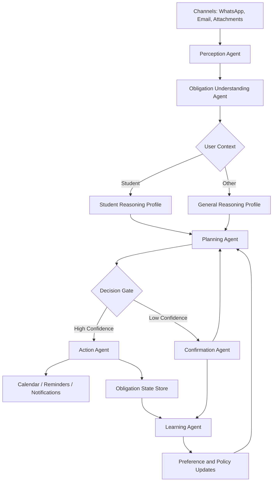

# Chatnalyxer Agent Builder Plan

## Why the current "agent" feels weak
The current architecture is strong on ingestion, extraction, redaction, and scheduling, but the "agent" is still implicit. It reads like:

`message in -> AI extracts obligation -> scheduler writes event`

That is useful, but it does not feel like a real agent because it does not clearly show:
- what the agent observes
- what the agent understands about the user
- how it decides what matters
- how it plans actions
- when it asks for confirmation
- how it learns from feedback

For presentations, this makes the idea feel correct but the agent-building story feel incomplete.

## Correct framing
Chatnalyxer should be presented as a:

**Context-aware obligation agent for students first, extensible to everyone else**

Not a calendar bot.
Not a task extractor.
Not a message summarizer.

The agent's job is:
1. Detect obligations from noisy communication.
2. Understand user context and urgency.
3. Build an execution plan.
4. Take safe actions.
5. Adapt from corrections and outcomes.

## Agent Definition
The Chatnalyxer agent has five layers:

1. **Perception Layer**
   Reads WhatsApp, email, attachments, OCR, and metadata.

2. **Understanding Layer**
   Identifies obligation type, deadline, confidence, source evidence, and user context.

3. **Planning Layer**
   Decides priority, timing, reminders, and whether the case should be auto-handled or sent for review.

4. **Action Layer**
   Creates reminders, drafts schedules, updates state, and triggers notifications.

5. **Learning Layer**
   Uses user edits, confirmations, dismissals, and completion outcomes to improve future planning.

## Final Agent Architecture

## Best one-line positioning
**Chatnalyxer is a privacy-focused obligation agent that turns noisy communication into context-aware plans and safe actions.**
